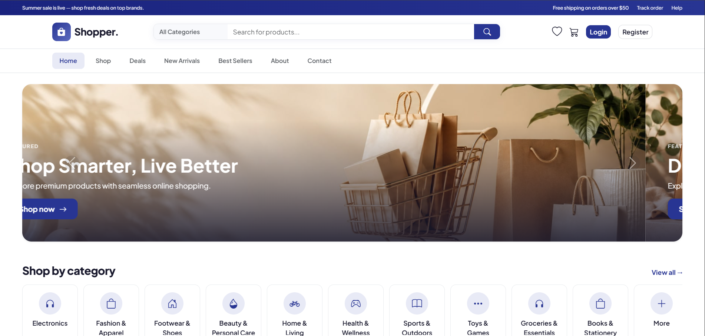
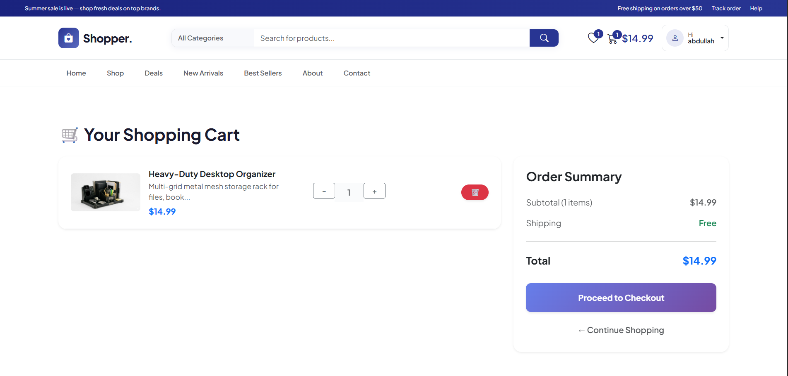
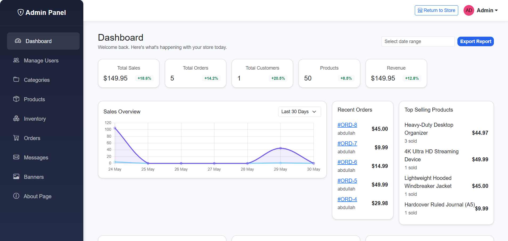

# EcommerceApp

A full-featured ecommerce storefront built with **ASP.NET Core MVC** and **.NET 10**. Includes product catalog, shopping cart, Stripe payments, order management, and an admin dashboard.

## Features

### Storefront
- Product catalog with categories, search, filters, deals, and best sellers
- Product detail pages with list/sale pricing
- Shopping cart and wishlist
- Stripe card checkout — orders are created **only after payment succeeds**
- User accounts with profile management
- Contact form and customizable About page

### Authentication
- Cookie-based authentication with BCrypt password hashing
- Email verification on registration
- Forgot password / reset flow (MailKit)
- Role-based access: `admin` and `user`

### Admin Panel
- Dashboard with revenue, orders, users, and low-stock alerts
- Sales charts (7-day trend, category breakdown, top products)
- Product, category, and banner management (Cloudinary image uploads)
- Order management and status updates
- User management (roles, block/unblock, delete)
- Inventory tracking
- Contact message inbox

## Tech Stack

| Layer | Technology |
|-------|------------|
| Framework | ASP.NET Core MVC (.NET 10) |
| Database | SQL Server + Entity Framework Core |
| Payments | Stripe.net |
| Email | MailKit |
| Images | Cloudinary |
| Security | BCrypt, cookie auth, role authorization |

## Prerequisites

- [.NET 10 SDK](https://dotnet.microsoft.com/download)
- SQL Server (LocalDB or Express)
- [Stripe](https://stripe.com) test account
- Optional: [Cloudinary](https://cloudinary.com) for product/banner images
- Optional: SMTP credentials for email verification and order notifications

## Getting Started

### 1. Clone the repository

```bash
git clone https://github.com/YOUR_USERNAME/EcommerceApp.git
cd EcommerceApp/EcommerceApp
```

### 2. Configure settings

Copy or edit `appsettings.Development.json`. Use [User Secrets](https://learn.microsoft.com/en-us/aspnet/core/security/app-secrets) for local development — **never commit real API keys or passwords**.

```json
{
  "ConnectionStrings": {
    "DefaultConnection": "Server=.\\SQLEXPRESS;Database=EcommerceApp;Trusted_Connection=True;TrustServerCertificate=True"
  },
  "Stripe": {
    "PublishableKey": "pk_test_YOUR_KEY",
    "SecretKey": "sk_test_YOUR_KEY",
    "Currency": "usd"
  },
  "EmailSettings": {
    "FromEmail": "your@email.com",
    "SmtpServer": "smtp.gmail.com",
    "Port": "587",
    "Username": "your@email.com",
    "Password": "YOUR_APP_PASSWORD",
    "Enabled": "false"
  },
  "CloudinarySettings": {
    "CloudName": "YOUR_CLOUD_NAME",
    "ApiKey": "YOUR_API_KEY",
    "ApiSecret": "YOUR_API_SECRET"
  }
}
```

### 3. Apply database migrations

```bash
dotnet ef database update
```

If the EF Core tools are not installed:

```bash
dotnet tool install --global dotnet-ef
```

### 4. Run the application

```bash
dotnet run
```

Open the app in your browser:

- HTTPS: `https://localhost:7092`
- HTTP: `http://localhost:5154`

### 5. Create an admin user

1. Register at `/Account/Register`
2. Promote the account in SQL Server:

```sql
UPDATE Users SET UserRole = 'admin' WHERE Email = 'your@email.com';
```

3. Sign in again and navigate to `/Admin/Dashboard`

## Stripe Test Checkout

Use [Stripe test cards](https://stripe.com/docs/testing):

| Field | Value |
|-------|-------|
| Card number | `4242 4242 4242 4242` |
| Expiry | Any future date |
| CVC | Any 3 digits |

## Project Structure

```
EcommerceApp/
├── Controllers/       # MVC controllers (Home, Cart, Admin, Account, etc.)
├── Data/              # ApplicationDbContext
├── Models/            # Entity models
├── Services/          # CheckoutService, EmailService, CloudinaryService
├── Views/             # Razor views
├── Migrations/        # EF Core migrations
├── wwwroot/           # Static assets (CSS, JS, images)
├── Program.cs         # App startup and middleware
└── appsettings.json   # Configuration
```

## Key Routes

| Route | Description |
|-------|-------------|
| `/` | Home page |
| `/Home/Shop` | Product listing |
| `/Cart` | Shopping cart |
| `/Account/Login` | Sign in |
| `/Account/Register` | Create account |
| `/Admin/Dashboard` | Admin dashboard (admin role required) |

## 📸 Screenshots

### Home Page


### Cart Page


### Admin Dashboard


## License

Portfolio / educational project.
